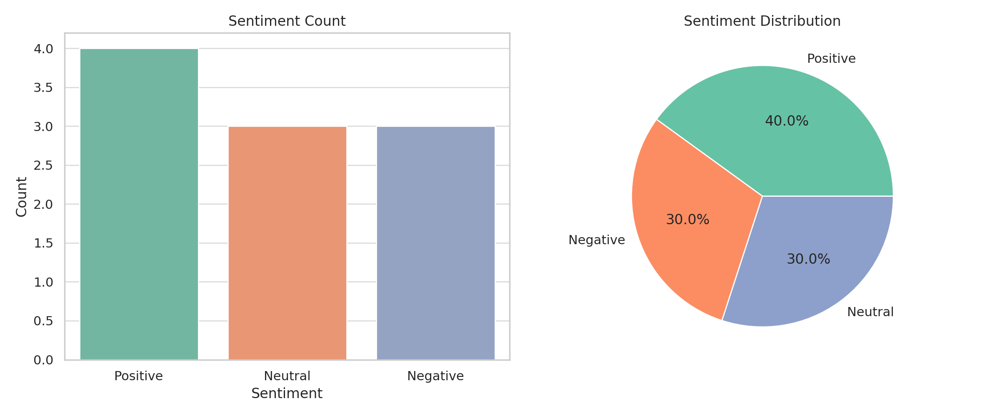

💬 OIBSIP - Sentiment Analysis on Play Store Reviews
Level 1 Task – Data Analytics Internship at Oasis Infobyte

📝 Project Description
This project performs Sentiment Analysis on user reviews from Google Play Store apps. It leverages natural language processing to classify reviews as Positive, Neutral, or Negative, providing valuable insights into user opinions and app performance.

Understanding user sentiment helps developers enhance app features, fix issues, and build better user experiences.

📂 Dataset
We used a sample dataset simulating Play Store app reviews, including the following fields:

App Name

User Review

Predicted Sentiment

Original Label (if available)

🔑 Key Concepts & Challenges
Data Cleaning: Removed inconsistencies, added synthetic reviews for demo.

Sentiment Analysis: Used TextBlob to determine sentiment polarity.

Classification: Mapped polarity scores to Positive, Neutral, or Negative.

Visualization: Created bar and pie charts to show sentiment distribution.

Interpretation: Summarized overall user satisfaction and trends.

📈 Visualizations Included
Sentiment Count Bar Chart

Sentiment Distribution Pie Chart

  

🛠️ Technologies Used
Python

Pandas

Matplotlib

Seaborn

TextBlob

Jupyter Notebook

🎯 Learning Outcomes
Gained practical experience with NLP basics

Learned to clean, transform, and analyze textual data

Improved skills in data visualization and sentiment classification

📎 How to Run
Clone this repo

Install dependencies: pip install pandas textblob matplotlib seaborn

Run cleaning_project.py to perform the analysis

View output charts and Sentiment_Results.csv

✅ Output
A complete sentiment analysis project with clean data, visual insights, and an exportable CSV of review sentiments.

✨ About Me
I'm Sai Krishna Thukaram Munde, passionate about Python, Web Development, Data Analytics, and Machine Learning.

Let’s connect:

🌐 LinkedIn

📧 saimunde0804@gmail.com
